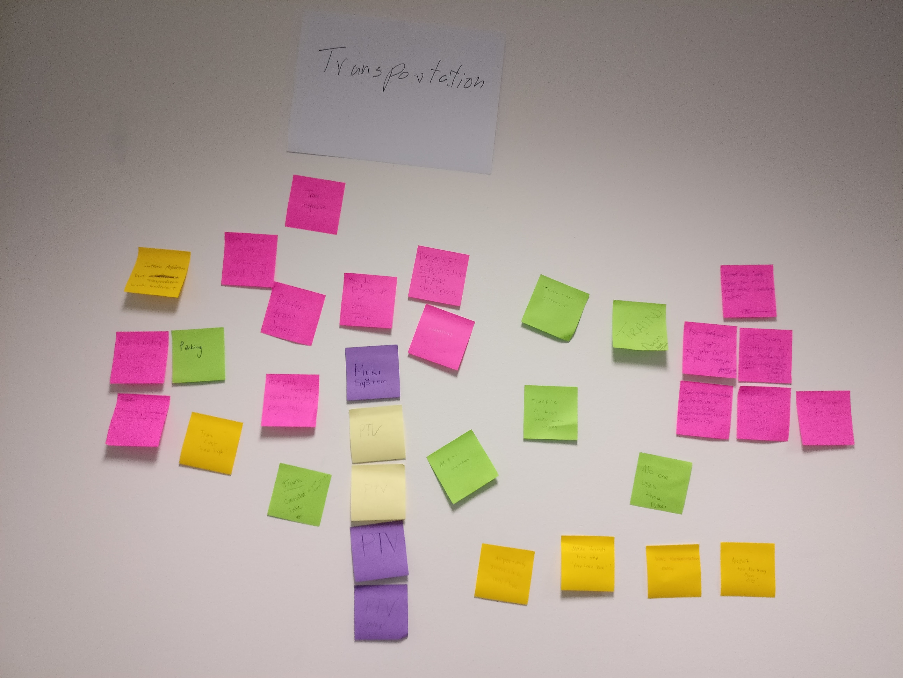
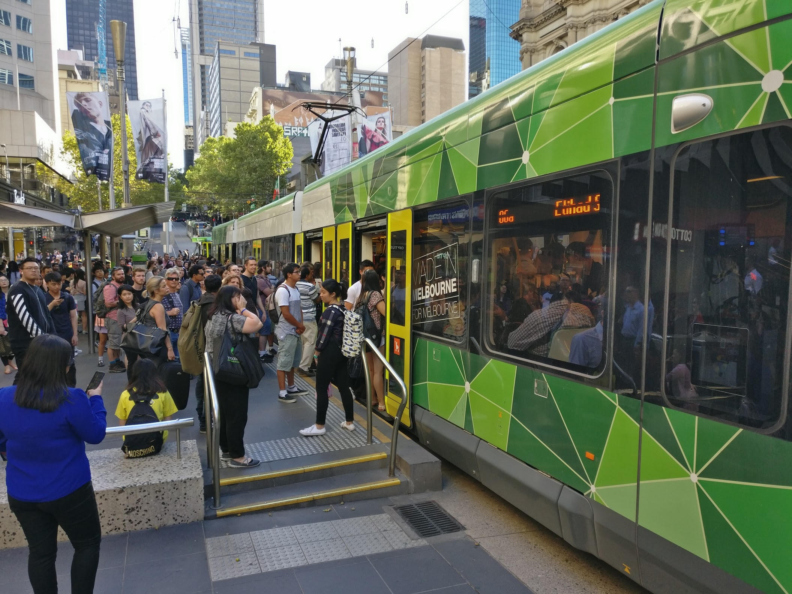
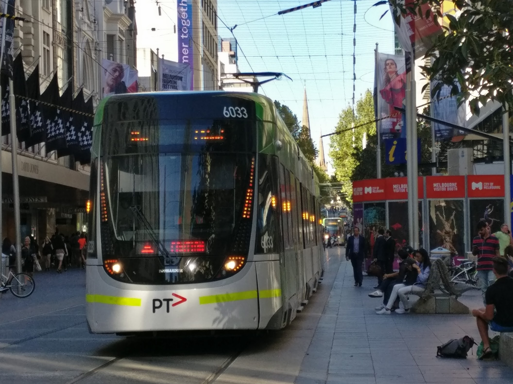

# Problem Proposal 
`A blog post describing the problem to be solved, the challenge to be addressed, or the opportunity to be explored int the project. The post should include photos and links to articles that serve as evidence that the problem is genuine.  The blog post should contain evidence of the ideation process (e.g. photos of the post-it notes, mind maps, etc.)`

## Problem
- Trams overcrowded that leads to injuries (http://mojonews.com.au/a-risky-ride-melbournes-trams-not-keeping-up-to-pace-with-overcrowding/)
- Lack of staff (http://www.ptua.org.au/melbourne/problem/)
- Too hard to find myki card, please allow touch with devices (http://www.abc.net.au/am/content/2012/s3661861.htm, http://www.smh.com.au/comment/mad-myki-stops-logic-in-its-tracks-20140221-337ed.html, http://www.theage.com.au/victoria/onthespot-myki-fines-to-be-scrapped-from-next-year-20160525-gp434m.html)
- Announcement/ notification trams is beneficial (http://www.heraldsun.com.au/news/victoria/yarra-trams-melbourne-to-make-announcements-in-vietnamese/news-story/4074cd2c093a52c0b9b129ecae959d30)

Brainstorming activity:
We performed an intergroup activity in the first workshop to highlight the things that define Melbourne for us, and by induction, continue in attempting to find just what are the problems that people would bring up about their everyday interactions with the fabric of society in this city. From the activity, we have managed to practically scoop up several key categories everyone identified in unison: Public Transport, Living Costs and Standards, as well as Social Issues. 

[Insert the sticky note pictures here]

While we explore and connect our thoughts with all fields, one that particularly catches our interest is Public Transport, as it weaves through elements of the other categories in living costs and social issues by examining its role in moving people and help connect communities. 

~~There's also because one of our members is extremely infatuated with public transport, but we'll save that for another day.~~

Articles :
When we are talking about Melbourne, we can often relate with it's public transport. In Melbourne, trams is one of the most famous public transport that everybody use everyday. However, despite it's popularity, we know that there are still numerous complaints and problems about trams. In this blog post, we will discuss about problems regarding trams and it's system, challenge to be addressed and opportunity to solve and explored in the project.

Even based on our brainstorming and discussion of problems in class, it's pretty evident that most of us agree that there is a few things that needs improvement in public transport, whether its the service, ticketing, or general information of how things work. 

(Okay, maybe more than a few.) 

One particular field that we have highlighted so far is Melbourne's iconic mode of transport: Trams. First problem that we found is distribution of passengers. We can see that our human nature will lead us to go into the tram even though the tram in front of us is full of people. While this is a completely rational line of thought, in Melbourne, trams often come "in packs", and they often go to the same stops people want to go to, despite different routes, such as the Swanston Street and Collins Street tram corridors which has lines serving the same stops for a reasonable length. Based on our discussion with friends, this way of thinking occurs because we don't know the conditions on other trams, or perhaps unsure where other trams would go. Therefore, we think that the other trams will be as crowded as the first tram and we jump into that tram. Sometimes this misconception leads to conditions where some trams might be really crowded while the other is not as crowded or even empty. 

The first tram of a pack in Bourke St mall is already crowded and people are forcing themselves in. 

After a long wait for trams, usually one would find 3-4 trams servicing the same stop pattern coming up in close intervals of one another, with the latter trams emptier. 

When trams is overcrowded, it can leads to numerous issues. From the *first article*, we can see that injuries rate increase due to overcrowdedness. For instance, due to this overcrowdedness, passengers being caught in door and falling to and from platforms which contributes to injuries increases (http://mojonews.com.au/a-risky-ride-melbournes-trams-not-keeping-up-to-pace-with-overcrowding/). In addition to injury, overcrowdedness also make riding trams experience uncomfortable for some people. According to Mr Barber, "[he] travel on the No. 55 which goes past The Children’s and Women’s Hospital and [he] can see people struggling to get up on the stairs and sometimes they don’t even get a seat.". If this problem isn't resolved, people will seek alternatives and if people choose car, "... we are exacerbating the many documented health and environment at risks of car-dependence", said Mr Stone.

Second problem that we've found is the intricacies of Myki. From a quick search of opinion articles, we observed that myki card can be inconvenient for groups of users, such as short term tourists or visitors. For instance, "[tourists] may be on Melbourne for only two days, but [tourists[ must hunt out a vendor selling myki cards in this unfamiliar city, pay $6 a card for each family member, then top them all up with cash." (Lawrence Money). Furthermore, the card will be unusable after four years and all the balance on that card will be gone. Not only for tourists, people also think that Myki Card System is also inefficient for Melbourne residents. One of the efficiency that can be seen is that we need to queue for a long time just to top up our myki. Opposition public transport spokesman David Hodgett also agree with our inefficiencies view as he said that "the system should allow for tapping on and off with mobile phones, tablets and watches" (Adam Carey).

Third problem that we've found from our own experiences is regarding social behaviour and tram notification. We've found by observing that sometimes when people are on the trams, people will often look at their gadget or talking to their friends. We noticed that these behaviours resulted in them to forget to get off the tram at the right tram stop. From personal experience, and from informal discussions with peers, we know that if there is notification by the tram driver which some trams provide, it will be really beneficial and enable us to get off the trams on the right tram stop. Even though notification is good, however language barriers problem can arise for people with low listening skills. [citation needed]
